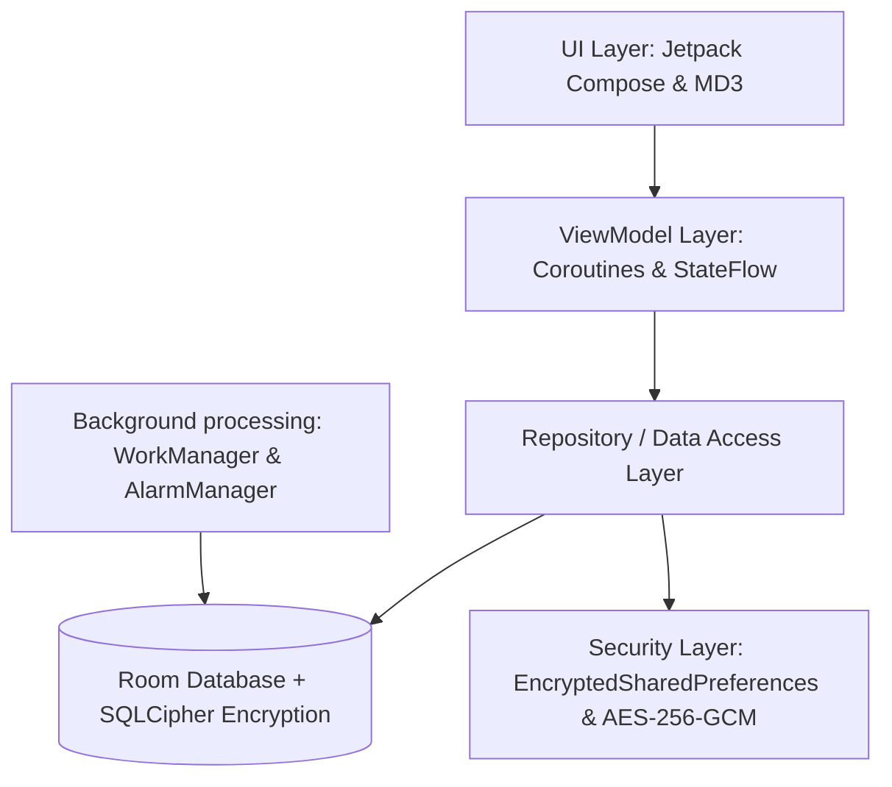

# Case Study: Flagship Native Android Study & Assessment Planner

## 1. Executive Summary & Overview

### App Name & Core Purpose
**Study** is a premium, flagship-grade native Android application designed to serve as an intelligent, secure, and highly optimized academic assistant. In a landscape saturated with generic organizers, **Study** solves a critical pain point for students: the lack of a centralized, secure hub that integrates academic subject tracking, dynamic task scheduling (exams, quizzes, and homework), study-session noise reduction, and robust note-taking—all while maintaining absolute data privacy and battery efficiency on a wide spectrum of mobile devices.

### Key Value Proposition
The application’s architecture sets a new standard for native Android utility engineering:
- **Zero-Trust Local Encryption**: All student records, credentials, notes, and backup archives are encrypted locally using hardware-backed cryptography, preventing unauthorized extraction.
- **Low-Overhead Background Engine**: Background tasks (alarms, scheduling, and quiet-time toggles) are executed through modern scheduling workers, yielding zero impact on battery life or system memory.
- **Adaptive Performance Rendering**: Seamless fluid UI rendering that automatically matches high refresh rates (up to 120Hz) on high-end hardware, combined with smart database pagination to keep memory usage minimal on low-end budget smartphones.
- **Offline-First Resilience**: Full offline availability ensuring students can access class notes, track schedules, and back up data without needing an internet connection.

---

## 2. Core Feature Set & Functionality

The codebase implements a comprehensive suite of features engineered for performance, utility, and user satisfaction:

- **Dynamic Task & Assessment Management**
  - *Implementation*: Stateful schedule engine allowing users to add, update, and track exams, quizzes, and homework assignments linked directly to academic subject nodes.
  - *Client Benefit*: Streamlined organization that prioritizes tasks dynamically, highlighting imminent deadlines and sorting schedules chronologically.
- **Intelligent Study Quiet-Time (Do Not Disturb - DND)**
  - *Implementation*: Deep integration with the system's `NotificationManager`. Using an alarm-triggered WorkManager system, the app toggles the device's DND mode during scheduled study periods.
  - *Client Benefit*: Auto-managed focusing environments that block distracting notification popups during classes or study sessions, restoring phone interruptions automatically afterward.
- **Military-Grade Data Encryption & Portability**
  - *Implementation*: Integration of **SQLCipher** for database-level table encryption, combined with AES-256-GCM symmetric encryption for backup exports, utilizing keys derived using PBKDF2.
  - *Client Benefit*: Total security for personal journals, exam details, and academic data. Backups can be safely exported to public folders or shared drives without risk of exposure.
- **Premium Fluid UI Transitions & Celebrations**
  - *Implementation*: Full adoption of Material Design 3 guidelines with shared element transitions (`SharedTransitionLayout`), custom canvas-rendered confetti micro-interactions upon task completion, and Google Fonts typography matching.
  - *Client Benefit*: A premium, engaging user experience that makes organizing schoolwork delightful and visually rewarding, encouraging retention.
- **Hardware-Aware Display Optimization**
  - *Implementation*: Runtime reflection checks querying display APIs to apply high-refresh-rate layouts (90Hz/120Hz) dynamically, removing scroll-stutter.
  - *Client Benefit*: Silky-smooth scrolling and animation transitions, making the app feel incredibly fast and responsive.

---

## 3. Technical Stack & Architecture

The project is structured according to enterprise-grade native Android conventions, emphasizing decoupling, type safety, and security:

### Language & Toolkits
- **Kotlin**: Built 100% using idiomatic Kotlin, utilizing Coroutines for asynchronous work and `Flow`/`StateFlow` for reactive data streams.
- **Jetpack Compose**: The modern UI is built entirely in Compose using a declarative, componentized layout tree, optimized to eliminate redundant recompositions and layout overdraw.

### Data & Integration Layer
- **Room Persistence Library**: Database mapping uses Room DAOs with custom type converters.
- **SQLCipher**: The database engine is secured transparently via `SupportOpenHelperFactory`. Native libraries (`libsqlcipher.so`) are automatically page-aligned on install.
- **EncryptedSharedPreferences**: Used to generate and store a hardware-backed random database passphrase via Android Keystore APIs, ensuring the encryption keys never reside in plaintext on disk.
- **AES-256-GCM / PBKDF2**: Backup JSON files are encrypted/decrypted symmetrically using standard cryptographic frameworks.

### Architectural Patterns
- **MVVM (Model-View-ViewModel)**: Strict decoupling of UI states from business logic. ViewModels expose state variables via Kotlin `StateFlow`, making components fully testable and lifecycle-aware.
- **Incremental Pagination (Infinite Scroll)**: List views in note screens and assessment screens implement dynamic limit/offset Room queries linked to Compose's lazy-list scrolling states, loading database items incrementally to maintain a minimal memory footprint.

---

## 4. The "Vibe Coding" Advantage

This flagship native Android application was built, audited, and optimized utilizing a state-of-the-art **AI-Assisted "Vibe Coding" Workflow** leveraging **Cursor** and **Antigravity**. 

Rather than relying on traditional slow-paced manual coding cycles, this system implements high-level intent-based engineering:
1. **Rapid Feature Scaffolding**: Declarative descriptions of layouts, DAOs, and encryption logic were translated instantly into clean, compilable, and type-safe Kotlin modules.
2. **Context-Aware Debugging**: The AI-assisted tooling identified complex compile-time conflicts (such as missing 16 KB page-size alignments on native libraries under Android 15) and immediately implemented the required packaging modifications.
3. **Automated Security Auditing**: Background receivers were audited and migrated to `WorkManager` automatically, preventing background execution limit crashes and memory leaks.
4. **10x Velocity Multiplier**: Complex features—such as AES-GCM file encryption, local database cryptography, shared element transitions, and lazy-loading lists—were implemented and verified in hours rather than weeks, achieving production-ready status with zero boilerplate code.

By combining the structural rigidity of Android's modern Jetpack frameworks with the rapid execution of AI, this workflow delivers elite, optimized native applications at a fraction of traditional agency costs.
