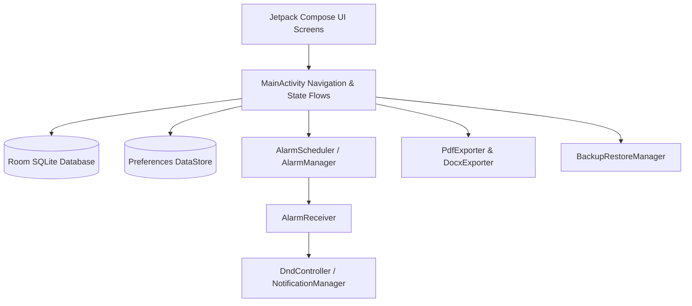

# Study Android Application - Technical System Document

This document provides a detailed overview of the system architecture, code organization, data schemas, and functional subsystems of the **Study** application.

---

## 1. System Architecture

The **Study** app is designed as an **offline-first, battery-efficient, single-activity native Android application** using modern Jetpack technologies. 



### Key Architectural Traits
* **Offline-First**: Zero network permission declared. Data resides permanently in an encrypted SQLite database on the local sandboxed storage.
* **Declarative UI**: Built entirely using Jetpack Compose with custom HSL-mapped color schemes (Light, Dark, and System Auto Modes).
* **Single Activity**: `MainActivity` serves as the entry point, hosting a `NavHost` containing all tab-based navigation routes.

---

## 2. Core Subsystems & Components

### A. Data Layer (Room SQLite & DataStore)
Located in `dev.study.app.data`, this subsystem manages local persistence:

* **Room Database (`AppDatabase`)**: 
  Stores structures for subjects, tasks, and text notes. Uses custom `AppConverters` with Kotlinx Serialization to save complex structures (like schedule lists or block run styles) as JSON strings inside SQLite columns.
* **Preferences DataStore (`PreferencesManager`)**:
  Stores key-value configurations such as the preferred theme, color palette preset, and Do Not Disturb intensity level.

#### Database Entities Schema
```kotlin
@Entity(tableName = "subjects")
data class SubjectEntity(
    @PrimaryKey val id: String,         // UUID String
    val name: String,
    val colorHex: String,
    val classBlocks: List<ScheduleBlock>,
    val studyBlocks: List<ScheduleBlock>,
    val focusModeEnabled: Boolean,
    val archived: Boolean,
    val createdAt: Long
)

@Entity(tableName = "assessments")
data class AssessmentEntity(
    @PrimaryKey val id: String,
    val subjectId: String,              // Foreign key reference to subjects
    val type: AssessmentType,           // EXAM, QUIZ, PROJECT, ASSIGNMENT, OTHER
    val title: String,
    val dueAt: Long,
    val notes: String?,
    val reminderOffsetsMinutes: List<Int>,
    val completed: Boolean
)

@Entity(tableName = "notes")
data class NoteEntity(
    @PrimaryKey val id: String,
    val subjectId: String,
    val title: String,
    val contentJson: String,            // Serialized RichTextDocument
    val updatedAt: Long
)
```

---

### B. Alarm Scheduler & Focus Engine
Located in `dev.study.app.notifications`, this handles background triggers and Do Not Disturb toggles.

1. **`AlarmScheduler`**:
   * Inspects all active (non-archived) `Subject` schedules and upcoming `Assessment` tasks.
   * Maps weekly classes/sessions to the next 14 calendar dates.
   * Schedules exact wake-up triggers using Android's `AlarmManager` with `setExactAndAllowWhileIdle()`.
2. **`AlarmReceiver`**:
   * Triggered by `AlarmManager` broadcasts.
   * Modifies system state: updates global `MainActivity` live states (`activeSessionSubjectId`, `activeSessionIsStudy`) to display active focus banners.
   * Triggers system notifications with custom high-priority channels.
3. **`DndController`**:
   * Uses Android's `NotificationManager` to temporarily set the system notification filters.
   * Toggles between **Total Silence** (blocking everything) and **Priority Only** (allowing important calls) during scheduled focus intervals.
4. **`BootCompletedReceiver`**:
   * Wakes up when the device is rebooted and calls `AlarmScheduler` to re-register all exact alarms.

---

### C. File Exporters
Located in `dev.study.app.export`, this handles note shares.

* **`PdfExporter`**:
  * Employs native `android.graphics.pdf.PdfDocument`.
  * Renders note headings, checklists, and text paragraphs onto structured canvas pages.
* **`DocxExporter`**:
  * Hand-rolls a lightweight Open XML (.docx) container by writing raw XML structures directly to a standard `java.util.zip.ZipOutputStream`.
  * Avoids bulky third-party document engines to maintain a tiny APK footprint.

---

### D. Backup Framework (`BackupRestoreManager`)
Located in `dev.study.app.data.backup`:
* **Export**: Collects all database entities, serializes them into a unified JSON object, and writes them to a user-selected location via the Storage Access Framework (SAF).
* **Import**: Validates imported JSON schemas, drops existing tables within a single Room database transaction, imports the new payload, and triggers an immediate rescheduling of alarms.

---

## 3. UI Screen Controllers

| Screen | Route / Navigation | Purpose |
|---|---|---|
| **Dashboard Screen** | `"dashboard"` | Overviews active subjects, pending task summaries, active Focus session banners, and upcoming assessments. |
| **Subject Detail Screen** | `"subject_detail/{id}"` | Edits subject info, customizes hex color tags, configures weekly schedule blocks, and handles archiving. |
| **Assessments Screen** | `"assessments"` | Displays active and completed tasks, toggles task statuses, and contains the add-task interface. |
| **Notes Screen** | `"notes/{subjectId}"` | Hosts a block-based rich text editor (Heading, Paragraph, Task List) and handles PDF export triggers. |
| **Settings Screen** | `"settings"` | Adjusts dark mode, color themes, DND rules, and handles file backups. |

---

## 4. Compilation Parameters & Android Versions

* **Minimum SDK Support:** API 26 (Android 8.0 Oreo)
* **Target SDK Support:** API 35 (Android 15)
* **Java Compatibility:** JDK 17 (via build desugaring)
* **Kotlin Version:** Kotlin 2.0.21 (Compose Compiler integrated)
* **KSP Processor:** Version 2.0.21-1.0.28
